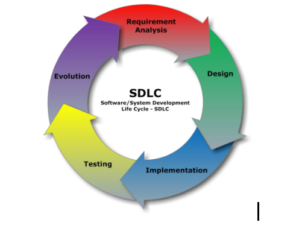

# Requirement Analysis

## Software Development Life Cycle (SDLC)

## Requirement Analysis Questions

- Who are the users of this product?
- What should the software do?

## **Class identification**

- Describe the software in as much detail as possible
    - For the sake of your own sanity, avoid using the word "class" in your description!
- For example: "A Student Information System (SIS) allows students to register for a section of a course.
    - **DESIGN TIP**: It's important to recognize that a student does not register for a course itself, but in a specific section of the course.
- Format the **nouns** in **bold** and the __verbs__ in __underline__
    - "A Student Information System **(SIS)** allows **students** to __register__ for a **section** of a **course**
- Write a list of all nouns with the verbs associated with that noun in a sub-list

| For Example |
|:-------:|
| SIS |
| Student: registers |
| Course |
| Section| 

## Use-case scenarios

- A **use-case scenario** is a specific sequence of events.

| Use Case Name | register for course|
| :----------: | ------------ |
| Primary Actor | Student |
| Supporting Actor(s) | Course |
| Summary | student registers for a course |
| Preconditions | 1. Student exists in database (database has student)   2. Course exists in the database (database as course)   3. Section of course if currently being offered (course has section) |
| Normal Flow of Events | 1. Student finds course section in database   2. Student registers for selected section |
| Extensions |  1. Alternatives to step 1   &nbsp;&nbsp; a. Student could register directly with course reference number (CRN)   2. Alternatives to step 2   &nbsp;&nbsp; a. Admin could register student |
| Post conditions | 1. Student has section in their course section list   Course section has student in student list |

## Revealing classes

- Use-case analysis can reveal additional information about classes
- Note:
     - **has-a** and **ownership** relationships often result in fields rather than methods
      - "database has student"
      - "course list"
    - When we find **collections** we should be consistent about of naming 
        - "section list"
        - "student list"

        

