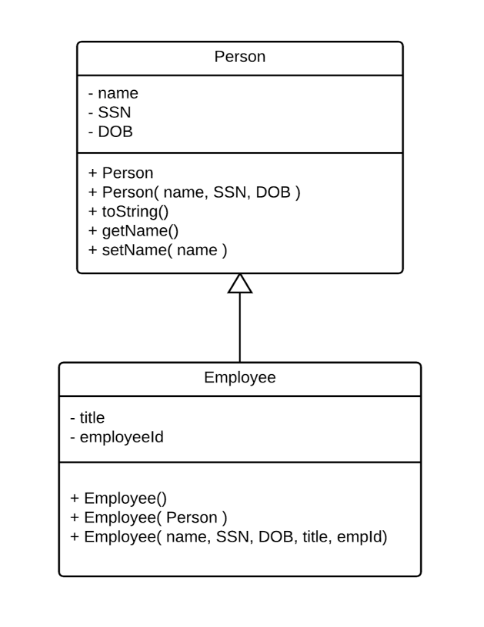

# Java Inheritance

## Readings

- [Tutorialspoint Java Inheritance](https://www.tutorialspoint.com/java/java_inheritance.htm)
- [Java Doc Inheritance](https://docs.oracle.com/javase/tutorial/java/IandI/subclasses.html)

## Inheritance

- **inheritance** is the process of *deriving* one class from another
    - The **derived class (subclass)** gets all of the field and methods of the other **base class (superclass)**
    - "The idea of inheritance is simple but powerful: When you want to create a new class and there is already a class that includes some of the code that you want, you can derive your new class from the existing class. In doing this, you can reuse the fields and methods of the existing class without having to write (and debug!) them yourself." (oracle).

## Inheritance UML

- Inheritance is used to implement an **IS-A** relationship
- For example, an *Employee* is a *Person*
- In the UML diagram, use an arrow pointing from the *subclass* to the *superclass*
- You do not list the inherited fields / methods in the *subclass*



## Superclass

``` java
public class Person {

	private String name;

	// initialize to default value, e.g. "anonymous"
	public Person(){}

    // initialize to parameter
	public Person(String n){ }

	// return value of _name
	public String getName(){ return name; }

    // change value of _name
	public void setName(String n){ name = n; }
}
```

## Subclass

- We can create a *subclass* of the Person class, for example, **Employee**
    - by *extending*, we automatically get all the fields and methods of the *superclass*
    - we can add more fields and methods
    - when overriding the *constructor*, we call the constructor of the *superclass* using the **super** keyword

``` java
public class Employee extends Person {

	int employee_id;
	String title;

	public Employee(int id) {
             super();
             employee_id = id;
	}

	public Employee(int id, String n) {
             super(n);
             employee_id = id;
	}

    public int getId() {
           return employee_id;
    }
}
```

## Polymorphism

- **Polymorphism** is "the condition of occurring in several different forms"
    - In programming, it usually means using a *superclass* reference to refer to a *subclass*
- For example, an *Employee* object can be stored in a a collection (List) of *Person*
- You can determine if a *superclass* object is an instance of a particular *subclass* by using the **instanceof** keyword

``` java
Person p = new Employee( 0, "Jane" )

if( p instanceof Employee ){
    System.out.println( p.getName() + " is employee #" + p.getId() );
} else {
	System.out.println( p.getName() + " is unemployed." );
}
```

## Reflection

- "Reflection is commonly used by programs which require the ability to examine or modify the runtime behavior of application running in the Java virtual machine"
    - **Reflection** is a way to get information about an object at runtime
    - It is an advanced topic, we will just scratch the surface
- Java has an *Object* class and a *Class* class!
    - Every Java class has the **Object class** at the top of the hierarchy
    - The **Class class** contains information about a class
- Some Reflection methods

| method | description |
| ---- | ---------------------------------------------------------- |
| getClass() | returns *Class* object of the given type
| getSuperClass() | returns the *superclass* of a Class |
| getDeclaredFields() | gets the fields that are declared in that class (not superclass) |
