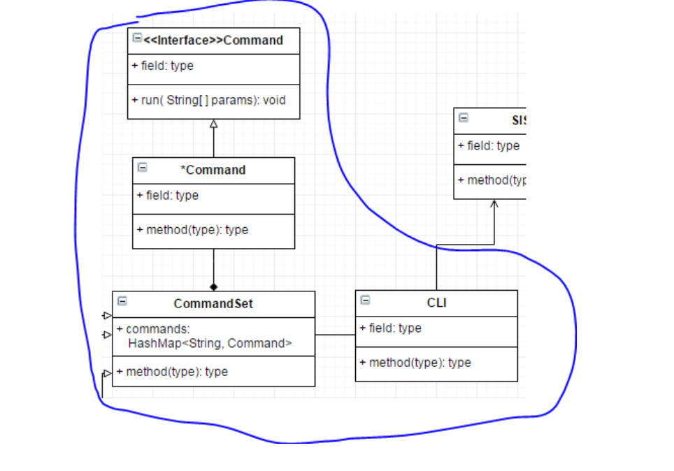

# Java Command-line Interface

## Object-oriented CLI

- Our Java OO CLI subsystem will contain the following
    - The **Command interface**, which specifies the method that all Commands must implement ```void run(String[] params)```
    - Each **Command object** is an instance of a unique class, which implements the *Command interface*
    - The **CommandSet** contains a *Hashmap* of *Command* objects
    - The **CLI** class has a *CommandSet*



## Java Code

### The Command Interface

- Specifies the *contract* that all "Commands" must adhere to

``` java

public interface Command {

    void run(String[] params);

}
```

### The CommandSet class

- The *Command* classes are defined inside the *CommandSet*
- The *Command* objects are instantiated and added to the *HashMap* in the constructor
- The constructor is places before the *Command* definitions for our convenience, so we are able to see the commands in the *HashMap* neat the top of the file

``` java
import java.util.HashMap;

public class CommandSet {

	HashMap<String, Command> commands;

    /************* CONSTRUCTOR ****************/

	public CommandSet() {

		commands=new HashMap<String, Command>();

		// add commands here
		commands.put("echo", new echoCmd());
	}

    /************* COMMAND DEFINITIONS ****************/

	/**
	 * echo command - prints the parameters
	 */
	class echoCmd implements Command {
		public void run(String[] params) {

			for( int i=0; i<params.length; i++)
				System.out.print( params[i] + " " );
			System.out.println();
		}
	}
}

```

### The CLI class

- The CLI class is the worker, running the command loop
- As long as there is valid input
    - Read a line
    - Try to split into command name and parameters
    - Process the command
- When processing the command
    - Use the command name to get the *Command* object from the *HashMap*
    - Invoke/Call/execute the *Command* object's run method with the argument list (params)

``` java
import java.io.BufferedReader;
import java.io.FileReader;
import java.io.IOException;
import java.io.InputStreamReader;
import java.util.HashMap;

public class CLI {

	BufferedReader reader;
	HashMap<String, Command> commands;
	CommandSet cmdSet;

	/************CONSTRUCTOR**************/

	// initialize fields and add commands
	public CLI(){

		CommandSet base = new CommandSet();
		commands = base.commands;
	}

	/*********** ACCESSORS *********************/

	public String getCmdList(){
		String clist = "[ ";

		for( String key : commands.keySet()){
			clist += key + ", ";
		}

		clist += " ]";
		return clist;
	}

	/************* MODIFIERS ************/

	public void setReader( BufferedReader in){
		reader=in;
	}

	public void setCommandSet( CommandSet cs ){
		commands = cs.commands;
	}

	/************ PRIVATE METHODS ******************/

	// get a command and call it's run method with params
	private void process(String cmd, String[] params){

		if(commands.containsKey(cmd))
			commands.get(cmd).run(params);
		else
			System.out.println("Command not recognized");

	}

    /************** PUBLIC METHODS ************************/

	// run the CLI loop
	public void start() throws IOException{

		String line, cmd;
		String[] params;

		// read until we run out of input
		while((line = reader.readLine()) != null){

			line = line.trim();

			// ignore whitespace lines and lines beginning with #
			if(line.equals("") || line.charAt(0)=='#')
				continue;

			// does this command have params?
			int i = line.indexOf(' ');
			if( i > -1){
				cmd = line.substring(0,i);
				params = line.substring(i+1).split(" ");
			}
			else{
				cmd = line;
				params = new String[]{};
			}

			// run the command
			process(cmd, params);
		}
	}

	/************ UNIT TESTING ****************/

	public static void main(String[] args){

		// read from consoleIn
		BufferedReader consoleIn;
		consoleIn = new BufferedReader(new InputStreamReader(System.in));

		/* OR READ FROM A FILE:
		// reading from a file
		BufferedReader fileIn;
		fileIn = new BufferedReader(new FileReader("testinput"));
		*/

		CLI cli = new CLI();
		cli.setReader(consoleIn);

		try {
			cli.start();
		} catch (IOException e) {
			// TODO Auto-generated catch block
			e.printStackTrace();
		}
	}
}

```
