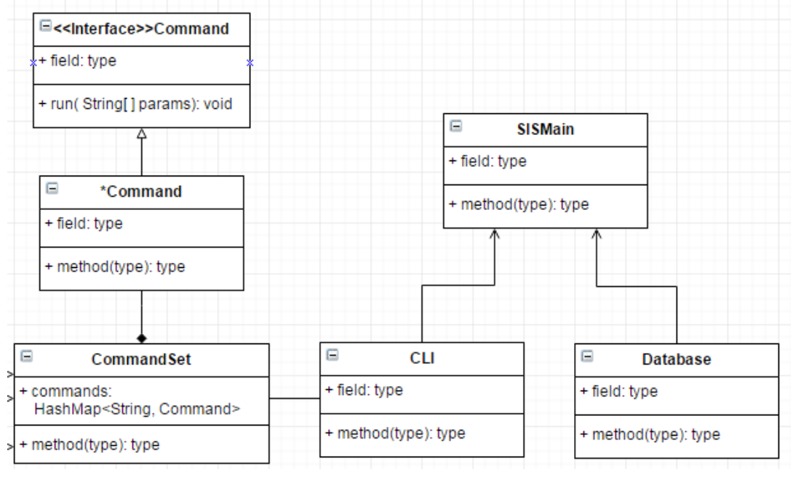

# SIS CLI

## System overview

- The *SISMain* class will serve a few purposes
    - This main will be used to execute our full program
    - *SISMain* will have instances of *CLI* and *Database*
    - CLI commands will use methods of SISMain, SISMain's database, and SISMain's cli



## SISMain

- The *SISMain* class will contain **static** instances of *Database* and *CLI*
    - In this case, static means we do not need to instantiate the SISMain class to access the Database and CLI. This will allow us to access the methods of the Database directly from the commands

``` java
public class SISMain {

	public static Database db;
	public static CLI cli;
	public static User currentUser;

	public static void initialize(){

		// initialize the database & CLI

		// YOUR CODE HERE
	}

	public static void login(String uname, String pword){

		// try to find a User in the db with given credentials
		// if successful, set currentUser

		// YOUR CODE HERE
	}

	public static void logout(){

		// unset currentUser - set to null

		// YOUR CODE HERE
	}

	public static void start(){

		// start the cli

		// YOUR CODE HERE
	}


	public static void main(String args[]){

		// notice how we can initialize and start SISMain without instantiating
		SISMain.initialize();
		SISMain.start();

	}
}
```

## Commands

- Base commands are shared by all users
- Notation
    - Arguments in ```< >``` angle brackets are required
    - Arguments in ```[ ]``` square brackets are optional
    - Arguments with an asterisk ```*``` means you can have 0 or more
    - Arguments separated by pipe symbols ```|``` are options

## Base Commands

- ```echo [argument]*```
- ```help [command]```
- ```login <username> <password>```
- ```logout```

### Example: login command

- Implement the **loginCmd** class *inside* of CommandSet
- In the run method
    - Verify that params is not null and that the length is at least 2. If these conditions are met, take the first argument **params[0]** to be username and the second **params[1]** to be the password
    - Use the arguments to call **SISMain.login**
- **DO NOT FORGET TO PUT LOGIN IN THE COMMANDS HASHMAP!**

``` java
class loginCmd implements Command{
    public void run(String[] params) {

        // TODO: verify that params is not null and has length at least 2

        SISMain.login( params[0], params[1] )
    }
}
```

## Testing you CLI

- You can (and should) test your CLI using a command input file. To do this, see the code in *CLI* main function
    - You can use empty lines and comment lines (starting with a ```#```) to organize your test input file(s). You can use the echo command to annotate the output
    - Note, that commands do not automatically echo output

### Sample Input File

```
##
# sample test input file
##

echo Hello, World!
help

#  this assumes that you have created a root user directly in the code
login root root
logout

```

### Sample Output

```
Welcome to the SIS.
Hello, World!
Commands: [ help, logout, login, echo ]
Logged in user root.
Logged out.
Goodbye.
```
